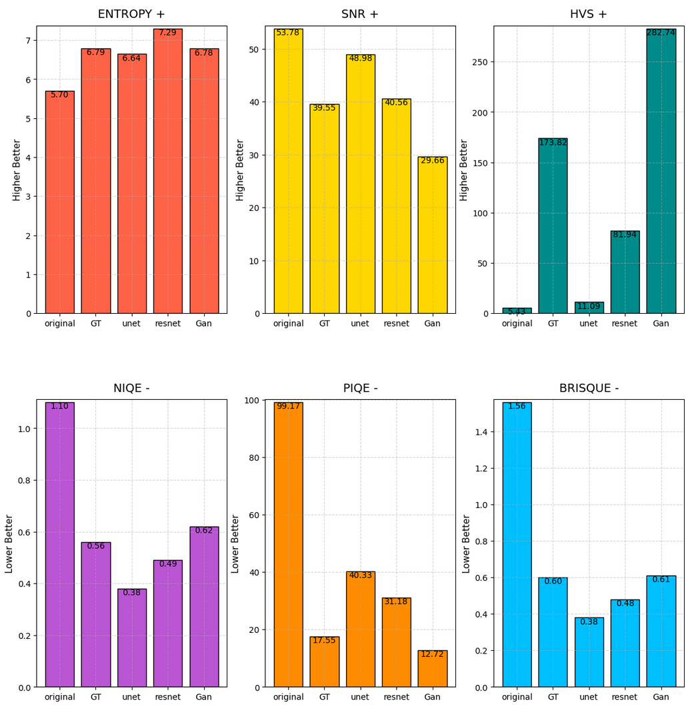

# 🚀 Mars Image Enhancement with U-Net | Planetary Image Super-Resolution 🌌

This project focuses on enhancing low-quality Mars and crater images using a **deep U-Net** model trained on patch-wise satellite imagery. Designed for planetary applications at **ISRO – Space Applications Centre**, it leverages a U-Net architecture with reflection padding, clean patch processing, and no-reference image quality evaluation.

---

## 🧠 Key Features

- ✅ Custom **U-Net model with reflection padding**
- ✅ Trained on 512×512 patches from 2048×2048 images
- ✅ **Gaussian-weighted blending** for artifact-free stitching
- ✅ Automated patch extraction, enhancement, and merging
- ✅ Evaluated using **BRISQUE, NIQE, PIQE, Entropy, SNR, HVS** (NumPy-only)
- ✅ DGX-compatible (no external metric libraries used)

---

## 🧱 Model Architecture (U-Net with Reflection Padding)

- **Encoder**: 4 convolutional blocks + max pooling  
- **Bottleneck**: Deep 1024-filter block  
- **Decoder**: 4 upsampling blocks with skip connections  
- **Padding**: ReflectionPadding2D to avoid border artifacts  
- **Output**: 3-channel (RGB) enhanced image with `sigmoid` activation  

---

## 📊 No-Reference Image Quality Metrics

| Image     | Entropy ↑ | SNR ↑ | HVS ↑  | NIQE ↓ | PIQE ↓ | BRISQUE ↓ |
|-----------|-----------|--------|--------|--------|--------|------------|
| Original  | 5.70      | 53.78  | 2.53   | 1.10   | 99.17  | 1.56       |
| GT        | 6.79      | 39.55  | 173.82 | 0.56   | 17.55  | 0.60       |
| **U-Net** | 6.64      | 48.98  | 11.09  | 0.38   | 40.33  | 0.38       |

- 📌 **U-Net** improved all quality metrics compared to original  
- 💡 Achieved high entropy and significant PIQE reduction  
- ✅ All metrics computed via custom NumPy-based functions (BRISQUE, NIQE, PIQE)

---

## 🔁 Inference Pipeline (3-Step)

1. 🔹 **Patch Extraction**  
   `split_image_smooth("mars13.jpg", "Patches_mars13", patch_size=(512, 512))`

2. 🔹 **Patch Enhancement**  
   `enhance_patches_with_model("Patches_mars13", "Enhanced_mars13_unet", "mars_enhancement_unet.pth")`

3. 🔹 **Final Stitching**  
   `final_smooth_stitch("Enhanced_mars13_unet", "unet_mars13.jpg", grid_size=(4, 4))`

---

## 🖼️ Visual Comparison

+------------------+--------------------+--------------------+
|   Original       |   Ground Truth     |   U-Net Output     |
|  mars13.jpg      | Enhanced_mars13.jpg|  unet_mars13.jpg   |
+------------------+--------------------+--------------------+

---

## 🔬 Image Quality Metrics (Visual Bar Chart)
Each metric is evaluated across 3 images: original, GT, unet.
The chart below is automatically generated via matplotlib for clarity.

📊 BRISQUE, NIQE, PIQE = lower is better
📈 Entropy, SNR, HVS = higher is better

---

📉 Chart:
### Folder Structure

📂 Patches_mars/               → Raw Mars image patches  
📂 Patches_crater/             → Raw crater image patches  
📂 Enhanced_mars_unet/         → U-Net enhanced Mars patches  
📂 Enhanced_crater_unet/       → U-Net enhanced Crater patches  
📄 mars_enhancement_unet.pth   → Trained U-Net model  
🖼️ Chart.png                   → Metrics chart  
🖼️ unet_mars13.jpg             → Final stitched output  
📜 *.py                        → Code files: patching, model, stitching, metrics

---

## ⚙️ Libraries Used
- 🐍 Python 3.9
- 📚 TensorFlow 2.x, OpenCV, NumPy, Matplotlib
- ⚡ Image metrics computed via NumPy-only functions for full portability
- 🖼️ Image patching via PIL + OpenCV
